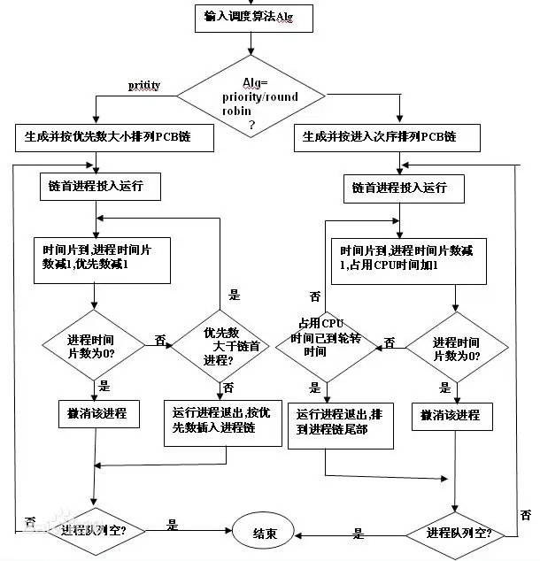
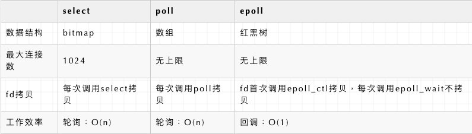

#### 1. 进程和线程的区别

+ **进程**：是资源分配的最小单位，一个进程可以有多个线程，多个线程共享进程的堆和方法区资源，不共享栈、程序计数器
+ **线程**：是任务调度和执行的最小单位，线程并行执行存在资源竞争和上下文切换的问题
+ **协程**：*是一种比线程更加轻量级的存在，正如一个进程可以拥有多个线程一样，一个线程可以拥有多个协程。

#### 2. 进程间通信方式
1. 管道pipe：管道是一种半双工的通信方式，数据只能单向流动，而且只能在具有亲缘关系的进程间使用。进程的亲缘关系通常是指父子进程关系。
2. 命名管道FIFO：有名管道也是半双工的通信方式，但是它允许无亲缘关系进程间的通信。
3. 消息队列MessageQueue：消息队列是由消息的链表，存放在内核中并由消息队列标识符标识。消息队列克服了信号传递信息少、
   管道只能承载无格式字节流以及缓冲区大小受限等缺点。
4. 共享存储SharedMemory：共享内存就是映射一段能被其他进程所访问的内存，这段共享内存由一个进程创建，但多个进程都可以访问。
   共享内存是最快的 IPC 方式，它是针对其他进程间通信方式运行效率低而专门设计的。它往往与其他通信机制，如信号量，配合使用，
   来实现进程间的同步和通信。
5. 信号量Semaphore：信号量是一个计数器，可以用来控制多个进程对共享资源的访问。它常作为一种锁机制，防止某进程正在访问共享资源时，
   其他进程也访问该资源。因此，主要作为进程间以及同一进程内不同线程之间的同步手段。
6. 套接字Socket：套解口也是一种进程间通信机制，与其他通信机制不同的是，它可用于不同及其间的进程通信。
7. 信号 ( sinal ) ： 信号是一种比较复杂的通信方式，用于通知接收进程某个事件已经发生。

#### 3. 用户态和核心态

+ 用户态：只能受限的访问内存，运行所有的应用程序

+ 核心态：运行操作系统程序，cpu可以访问内存的所有数据，包括外围设备

##### 3.1 为什么要有用户态和内核态：
由于需要限制不同的程序之间的访问能力, 防止他们获取别的程序的内存数据, 或者获取外围设备的数据, 并发送到网络

##### 3.2 用户态切换到内核态的3种方式：
+ 系统调用：主动调用，系统调用的机制其核心还是使用了操作系统为用户特别开放的一个中断来实现，例如Linux的int 80h中断。

+ 异常：当CPU执行运行在用户态下的程序时，发生了某些事先不可知的异常，比如缺页异常，这时会触发切换内核态处理异常。

+ 外围设备的中断：当外围设备完成用户请求的操作后，会向CPU发出相应的中断信号，这时CPU会由用户态到内核态的切换

#### 4. 操作系统的进程空间
+ 栈区（stack）— 由编译器自动分配释放 ，存放函数的参数值，局部变量的值等。

+ 堆区（heap）— 一般由程序员分配释放， 若程序员不释放，程序结束时可能由OS回收 。

+ 静态区（static）—存放全局变量和静态变量的存储

+ 代码区(text)—存放函数体的二进制代码。

#### 5. 操作系统内存管理

##### 5.1 存管理方式：页式管理、段式管理、段页式管理
+ 页式管理：在页式存储管理中，将程序的逻辑地址划分为固定大小的页（page），而物理内存划分为同样大小的页框，程序加载时，可以将任意一页放入内存中任意一个页框，这些页框不必连续，从而实现了离散分离。
  页式存储管理的优点是：没有外碎片（因为页的大小固定），但会产生内碎片（一个页可能填充不满）
+ 段式管理： 将程序的地址空间划分为若干段（segment），如代码段，数据段，堆栈段；这样每个进程有一个二维地址空间， 相互独立，互不干扰。
  段式管理的优点是：没有内碎片（因为段大小可变，改变段大小来消除内碎片）。但段换入换出时，会产生外碎片（比如4k的段换5k的段，会产生1k的外碎片）
+ 段页式管理：段⻚式管理机制结合了段式管理和⻚式管理的优点。简单来说段⻚式管理机制就是把主存先分成若⼲段，每个段⼜分成若⼲⻚，也就是说 段⻚式管理机制 中段与段之间以及段的内部的都是离散的

#### 6. 页面置换算法FIFO、LRU
置换算法：先进先出FIFO、最近最久未使用LRU、最佳置换算法OPT

##### 6.1 先进先出FIFO
缺点：没有考虑到实际的页面使用频率，性能差、与通常页面使用的规则不符合，实际应用较少

##### 6.2 最近最久未使用LRU
原理：选择最近且最久未使用的页面进行淘汰

优点：考虑到了程序访问的时间局部性，有较好的性能，实际应用也比较多

缺点：没有合适的算法，只有适合的算法，lFU、random都可以

##### 6.3 最佳置换算法OPT
原理：每次选择当前物理块中的页面在未来长时间不被访问的或未来不再使用的页面进行淘汰

优点：具有较好的性能，可以保证获得最低的缺页率

缺点：过于理想化，但是实际上无法实现（没办法预知未来的页面）

##### 7. 时间片轮询

###### 7.1 含义
时间片轮转调度是一种最古老，最简单，最公平且使用最广的算法。每个进程被分配一个时间段，称作它的时间片，即该进程允许运行的时间。如果在时间片结束时进程还在运行，则CPU将被剥夺并分配给另一个进程。
如果进程在时间片结束前阻塞或结束，则CPU当即进行切换。调度程序所要做的就是维护一张就绪进程列表，当进程用完它的时间片后，它被移到队列的末尾。

时间片轮转调度中唯一有趣的一点是时间片的长度。从一个进程切换到另一个进程是需要一定时间的--保存和装入寄存器值及内存映像，更新各种表格和队列等。
假如进程切换(process switch) - 有时称为**上下文切换(context switch)**，需要5毫秒，再假设时间片设为20毫秒，则在做完20毫秒有用的工作之后，CPU将花费5毫秒来进行进程切换。CPU时间的20%被浪费在了管理开销上。

为了提高CPU效率，我们可以将时间片设为500毫秒。这时浪费的时间只有1%。但考虑在一个分时系统中，如果有十个交互用户几乎同时按下回车键，将发生什么情况？
假设所有其他进程都用足它们的时间片的话，最后一个不幸的进程不得不等待5秒钟才获得运行机会。多数用户无法忍受一条简短命令要5秒钟才能做出响应。同样的问题在一台支持多道程序的个人计算机上也会发生。

结论可以归结如下：时间片设得太短会导致过多的进程切换，降低了CPU效率；而设得太长又可能引起对短的交互请求的响应变差。将时间片设为**100毫秒**通常是一个比较合理的折中。

###### 7.2 时间片大小的确定
+ 系统对响应时间的要求
+ 就绪队列中进程的数目
+ 系统的处理能力

##### 8. IO多路复用【搜索：IO模型】

###### 8.1 定义【什么是IO多路复用】

IO多路复用是一种同步IO模型，实现一个线程可以监视多个文件句柄；
一旦某个文件句柄就绪，就能够通知应用程序进行相应的读写操作；
没有文件句柄就绪时会阻塞应用程序，交出cpu。多路是指网络连接，复用指的是同一个线程【多个网络连接共用一个线程】

###### 8.2 为什么有IO多路复用机制?

没有IO多路复用机制时，有BIO、NIO两种实现方式，但有一些问题

+ 同步阻塞（BIO）：
  
  i:  服务端采用单线程，当accept一个请求后，在recv或send调用阻塞时，将无法accept其他请求（必须等上一个请求处recv或send完），无法处理并发

  ii: 服务器端采用多线程，当accept一个请求后，开启线程进行recv，可以完成并发处理，但随着请求数增加需要增加系统线程，**大量的线程占用很大的内存空间，并且线程切换会带来很大的开销，10000个线程真正发生读写事件的线程数不会超过20%，每次accept都开一个线程也是一种资源浪费**

+ 同步非阻塞（NIO）

    i:  服务器端当accept一个请求后，加入fds集合，每次轮询一遍fds集合recv(非阻塞)数据，没有数据则立即返回错误，**每次轮询所有fd（包括没有发生读写事件的fd）会很浪费cpu**

+ IO多路复用

  服务器端采用单线程通过select/epoll等系统调用获取fd列表，遍历有事件的fd进行accept/recv/send，使其能支持**更多的并发连接请求**

###### 8.3 IO多路复用的三种实现方式
+ select
+ poll
+ epoll

###### 8.4 select 缺点

+ 单个进程所打开的FD是有限制的，通过FD_SETSIZE设置，默认1024

+ 每次调用select，都需要把fd集合从用户态拷贝到内核态，这个开销在fd很多时会很大

+ 对socket扫描时是线性扫描，采用轮询的方法，效率较低（高并发时）

###### 8.5 poll函数
poll与select相比，只是没有fd的限制，其它基本一样

缺点：
+ 每次调用poll，都需要把fd集合从用户态拷贝到内核态，这个开销在fd很多时会很大

+ 对socket扫描时是线性扫描，采用轮询的方法，效率较低（高并发时）

###### 8.6 epoll函数缺点

epoll只能工作在linux下

###### 8.7 epoll LT 与 ET模式的区别

+ epoll有EPOLLLT和EPOLLET两种触发模式，LT是默认的模式，ET是“高速”模式。

+ LT模式下，只要这个fd还有数据可读，每次 epoll_wait都会返回它的事件，提醒用户程序去操作

+ ET模式下，它只会提示一次，直到下次再有数据流入之前都不会再提示了，无论fd中是否还有数据可读。所以在ET模式下，read一个fd的时候一定要把它的buffer读完，或者遇到EAGAIN错误

###### 8.8 epoll应用
+ redis
+ nginx

###### 8.9 select/poll/epoll之间的区别

##### 9. 虚拟内存

