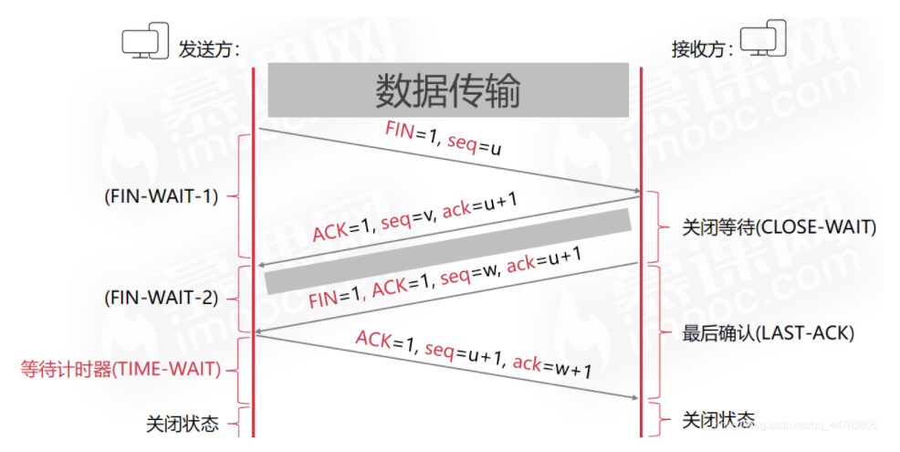
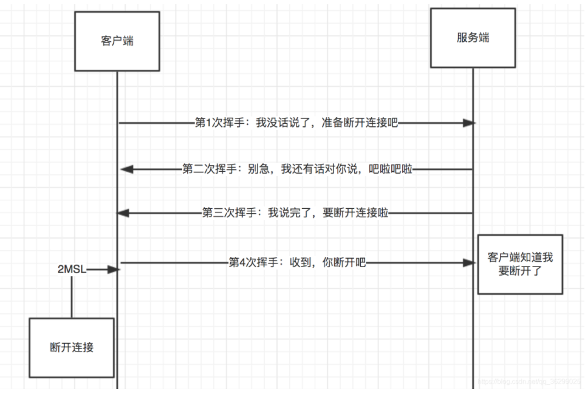

### 一

#### 1.进程与线程的关系
答：1、首先是定义
  
  进程：是执行中一段程序，即一旦程序被载入到内存中并准备执行，它就是一个进程。进程是表示资源分配的的基本概念，
  又是调度运行的基本单位，是系统中的并发执行的单位。
  
  线程：单个进程中执行中每个任务就是一个线程。线程是进程中执行运算的最小单位。
  
  2、一个线程只能属于一个进程，但是一个进程可以拥有多个线程。多线程处理就是允许一个进程中在同一时刻执行多个任务。
  
  3、线程是一种轻量级的进程，与进程相比，线程给操作系统带来侧创建、维护、和管理的负担要轻，意味着线程的代价或开销比较小。
  
  4、线程没有地址空间，线程包含在进程的地址空间中。线程上下文只包含一个堆栈、一个寄存器、一个优先权，
  线程文本包含在他的进程 的文本片段中，进程拥有的所有资源都属于线程。所有的线程共享进程的内存和资源。 
  同一进程中的多个线程共享代码段(代码和常量)，数据段(全局变量和静态变量)，扩展段(堆存储)。但是每个线程拥有自己的栈段， 
  寄存器的内容，栈段又叫运行时段，用来存放所有局部变量和临时变量。
  
  5、父和子进程使用进程间通信机制，同一进程的线程通过读取和写入数据到进程变量来通信。
  
  6、进程内的任何线程都被看做是同位体，且处于相同的级别。不管是哪个线程创建了哪一个线程，
  进程内的任何线程都可以销毁、挂起、恢复和更改其它线程的优先权。线程也要对进程施加控制，
  进程中任何线程都可以通过销毁主线程来销毁进程，销毁主线程将导致该进程的销毁，对主线程的修改可能影响所有的线程。
  
  7、子进程不对任何其他子进程施加控制，进程的线程可以对同一进程的其它线程施加控制。子进程不能对父进程施加控制，
  进程中所有线程都可以对主线程施加控制。
    
    url: https://www.zhihu.com/question/25532384

#### 2.进程之间通信方式
1. 管道pipe：管道是一种半双工的通信方式，数据只能单向流动，而且只能在具有亲缘关系的进程间使用。进程的亲缘关系通常是指父子进程关系。
2. 命名管道FIFO：有名管道也是半双工的通信方式，但是它允许无亲缘关系进程间的通信。
3. 消息队列MessageQueue：消息队列是由消息的链表，存放在内核中并由消息队列标识符标识。消息队列克服了信号传递信息少、
    管道只能承载无格式字节流以及缓冲区大小受限等缺点。
4. 共享存储SharedMemory：共享内存就是映射一段能被其他进程所访问的内存，这段共享内存由一个进程创建，但多个进程都可以访问。
   共享内存是最快的 IPC 方式，它是针对其他进程间通信方式运行效率低而专门设计的。它往往与其他通信机制，如信号量，配合使用，
   来实现进程间的同步和通信。
5. 信号量Semaphore：信号量是一个计数器，可以用来控制多个进程对共享资源的访问。它常作为一种锁机制，防止某进程正在访问共享资源时，
    其他进程也访问该资源。因此，主要作为进程间以及同一进程内不同线程之间的同步手段。
6. 套接字Socket：套解口也是一种进程间通信机制，与其他通信机制不同的是，它可用于不同及其间的进程通信。
7. 信号 ( sinal ) ： 信号是一种比较复杂的通信方式，用于通知接收进程某个事件已经发生。

#### 3.tcp udp 区别 【传输层】
1、TCP面向连接（如打电话要先拨号建立连接）；UDP是无连接的，即发送数据之前不需要建立连接。

2、TCP提供可靠的服务。通过TCP连接传送的数据，无差错，不丢失，不重复，且按序到达；UDP尽最大努力交付，即不保证可靠交付。

3、TCP面向字节流，实际上是TCP把数据看成一连串无结构的字节流;UDP是面向报文的。
    UDP没有拥塞控制，因此网络出现拥塞不会使源主机的发送速率降低（对实时应用很有用，如IP电话，实时视频会议等）

4、每一条TCP连接只能是点到点的;UDP支持一对一，一对多，多对一和多对多的交互通信

5、TCP首部开销20字节;UDP的首部开销小，只有8个字节

6、TCP的逻辑通信信道是全双工的可靠信道，UDP则是不可靠信道

##### 3.1 什么时候应该使用TCP？
当对网络通讯质量有要求的时候使用TCP，比如：整个数据要准确无误的传递给对方，这往往用于一些要求可靠的应用，
比如HTTP、HTTPS、FTP等传输文件的协议，POP、SMTP等邮件传输的协议。 在日常生活中，
常见使用TCP协议的应用如下： 浏览器，用的HTTP FlashFXP，用的FTP Outlook，用的POP、SMTP Putty，用的Telnet、 QQ文件传输 。

##### 3.2 什么时候应该使用UDP？
当对网络通讯质量要求不高的时候使用UDP，要求网络通讯速度能尽量的快，这时就可以使用UDP。 比如，日常生活中，
常见使用UDP协议的应用如下： QQ语音 QQ视频 （实时传递）有些应用场景对可靠性要求不高会用到UPD，比如长视频，要求速率

#### 4.tcp 3次握手  4次挥手

#### 5. http的报文格式 ，说几个头部
1. 一个HTTP请求报文由请求行（request line）、请求头部（header）、空行和请求数据4个部分组成
2. 请求头部由关键字/值对组成，每行一对，关键字和值用英文冒号“:”分隔。请求头部通知服务器有关于客户端请求的信息，典型的请求头有：
  
  User-Agent：产生请求的浏览器类型。
  
  Accept：客户端可识别的内容类型列表。
  
  Host：请求的主机名，允许多个域名同处一个IP地址，即虚拟主机。
3. HTTP响应也由三个部分组成，分别是：状态行、消息报头、响应正文。

#### 6. http和https的区别? https加密实现?
HTTPS（Secure Hypertext Transfer Protocol）安全超文本传输协议

它是一个安全通信通道，它基于HTTP开发，用于在客户计算机和服务器之间交换信息。它使用安全套接字层(SSL)进行信息交换，
简单来说它是HTTP的安全版。

http与https的区别在于

1） http一般使用的是80端口，而https使用的是443端口

2）http协议需要ca证书

3）http是明文传输的，而https是通过ssl加密之后传输的。

4）https使用的是非对称加密，所谓的非对称加密就是加密密钥与解密密钥是不相同的。

非对称加密需要两个密钥：公开密钥（publickey）和私有密钥（privatekey）。
公开密钥与私有密钥是一对，如果用公开密钥对数据进行加密，只有用对应的私有密钥才能解密；如果用私有密钥对数据进行加密，
那么只有用对应的公开密钥才能解密。因为加密和解密使用的是两个不同的密钥，所以这种算法叫作非对称加密算法。 
非对称加密算法实现机密信息交换的基本过程是：甲方生成一对密钥并将其中的一把作为公用密钥向其它方公开；
得到该公用密钥的乙方使用该密钥对机密信息进行加密后再发送给甲方；甲方再用自己保存的另一把专用密钥对加密后的信息进行解密。
另一方面，甲方可以使用自己的私密钥对机密信息进行加密后再发送给乙方；乙方再用甲方的公钥对加密后的信息进行解密

#### 7. 错误的状态码

2xx 表示成功
3xx 重定向
4xx 客户端报错
5XX 服务端报错

#### 8. 事务的隔离级别，说一下幻读
1.读未提交
2.读已提交
3.可重复度
4.串行化

5.幻读定义：
事务A 按照一定条件进行数据读取， 期间事务B 插入了相同搜索条件的新数据，事务A再次按照原先条件进行读取时，
发现了事务B 新插入的数据 称为幻读
url :https://zhuanlan.zhihu.com/p/103580034?utm_source=wechat_session

###二
#### 1.tcp四次挥手过程？最后为什么等待2msls 
1.四次挥手过程：

客户端=》发送方

接收方=》服务端

   1.发送方 向 接收方发送FIN释放连接请求报文，进入第一个等待时间FIN-WAIT-1

   2.接收方 收到 发送方的释放连接的请求，向发送方发送ack表示收到发送方的释放连接请求，
     但是还无法立即关闭，因为还要未完成处理的发送请求，因此进行关闭等待阶段，在这个期间
     接收方可以处理还未完成的发送请求；发送方收到接收方的第一次确认后进行第二次等待，
     等待它处理完发送请求（在这期间还可以进行数据的传输。）
  
   3.接收方处理完成之后，向发送方发送释放连接请求表示自己已经可以执行释放连接操作，
   并且携带ack再次确认。然后进入最后确认等待，等待发送方的确认，如果没有收到接收方ack，
   那么会进行重传。

   4.发送方收到接收方的再次确认，最后向接收方发送释放连接的确认。然后进行开启等待计时器
   （默认2MSL），在等待计时器期间是不会释放连接的（还会继续占用端口），最后等待计时器
    结束后，释放资源、

   MSL(Maximum Segment Lifetime),最长报文段寿命，它是任何报文在网络上存在的最长的最长时间，超过这个时间报文将被丢弃。一般建议设置为2分钟

2.为什么要四次挥手
因为不像建立连接的过程，接收方收到连接请求后可以立即发送SYN进行连接，释放资源时，
接受方在收到发送方的释放连接请求后，还需要一段时间来处理未完成的发送请求，
这里需要两次确认发送方的请求：第一次是未处理完，我还不能释放，但是收到了你的请求，
告诉发送方一声，等等我；第二次确认表示已经处理完请求了，我也可以进行释放了。

3.最后为什么等待2msls

等待2MSL就是为了确保服务器能够受到客户端最后的回应。

本质原因是网络是不可靠的，所以TIME_WAIT状态就是用来重发可能丢失的ACK报文。
如果发送方的最后一次ack没有被接收方收到的话，那么接收方会进行重传第三次的释放连接请求，
TIME_WAIT就是为了在这种情况下重发丢失了的ack报文。
也就是：
接收方等待最后一次ack+重发的第三次释放连接请求到达发送方的时间<=2MSL， 因此需要等待2MSL。

客户端=》发送方       

接收方=》服务端

#### 2. 事务，通过什么实现？除了行锁还有什么？
事务4大原则： 
 + 一致性 通过回滚，以及恢复，和在并发环境下的隔离做到一致性。
 + 原子性【使用 undo log ，从而达到回滚】 
 + 持久性【使用 redo log，从而达到故障后恢复】 
 + 隔离性 使用锁以及MVCC,运用的优化思想有读写分离，读读并行，读写并行

2. 锁： 行锁，表锁，页面锁

#### 3. 状态码 502是什么？ 
答： 这是服务器上的一个错误网关 ，因此说它是无效的，我们在出现了服务器502错误问题的时候，
最好是先清除下缓存或者是在服务器上进行刷新试试的，因为502错误牵扯的问题也是很多的，
最好是让程序们来去在服务器上下文章。

#### 4. 文件里面 两亿个数，找到最大100个的

+ 第三种方法是分治法，将1亿个数据分成100份，每份100万个数据，找到每份数据中最大的10000个，
  最后在剩下的10010000个数据里面找出最大的10000个。如果100万数据选择足够理想，那么可以过滤掉1亿数据
  里面99%的数据。100万个数据里面查找最大的10000个数据的方法如下：用快速排序的方法，将数据分为2堆，
  如果大的那堆个数N大于10000个，继续对大堆快速排序一次分成2堆，如果大的那堆个数N大于10000个，
  继续对大堆快速排序一次分成2堆，如果大堆个数N小于10000个，就在小的那堆里面快速排序一次，
  找第10000-n大的数字；递归以上过程，就可以找到第1w大的数。参考上面的找出第1w大数字，
  就可以类似的方法找到前10000大数字了。此种方法需要每次的内存空间为10^64=4MB，一共需要101次这样的比较。

+ 第四种方法是Hash法。如果这1亿个书里面有很多重复的数，先通过Hash法，把这1亿个数字去重复，
  这样如果重复率很高的话，会减少很大的内存用量，从而缩小运算空间，然后通过分治法或最小堆法查找
  最大的10000个数。

+ 第五种方法采用最小堆。首先读入前10000个数来创建大小为10000的最小堆，建堆的时间复杂度为O（mlogm）
  （m为数组的大小即为10000），然后遍历后续的数字，并于堆顶（最小）数字进行比较。如果比最小的数小，
  则继续读取后续数字；如果比堆顶数字大，则替换堆顶元素并重新调整堆为最小堆。整个过程直至1亿个数全部遍历
  完为止。然后按照中序遍历的方式输出当前堆中的所有10000个数字。该算法的时间复杂度为O（nmlogm），
  空间复杂度是10000（常数）。

#### 5. 系统的文件日志，几千万条，怎么找出出现最多的ip地址。
1 首先利用取模分块文件存储，如用hash(ip)对1000取模，这样就大概分成了1000个文件(同一个ip只可能出现在一个文件里)

2 然后 从一个文件开始到第1000个文件，对每个文件分别进行这种操作：
   放进内存中, 利用hash技术求出每个ip对应的出现次数，然后求出该文件中出现次数前10的放在内存中(堆或类快排)，剩下的丢掉     

3 此时内存中剩下10*1000个ip,用第一个文件的10个建立最小堆

4 然后 对于剩下的每一个ip:  与跟元素的出现次数比较，如果大于，替换之，然后调整堆使其保持最小堆的性质，否则，无处理(或者34步可以用下面方法代替)

（34的代替方案）用类似快速排序的方法选出出现次数前10的ip 即最小堆中始终保持最大的10个ip的出现次数

 ps:好像用类快排选择最大的k个数平均情况 T(n)=T(n/2)+n 时间复杂度应该为O(n) ，所以这个应该更好

#### 6. 三次握手中，为什么客户机最后还要再向服务器发送一次确认呢？
答：这是为了防止已失效的连接请求报文段突然又传到了服务器。所谓“已失效的连接请求报文段”是这样产生的。
考虑一种正常的情况，客户机发出连接请求，但因为连接请求报文丢失而未收到确认。
于是客户机再重传了一次连接请求，后来收到了确认，建立了连接。数据传输完后，就释放了连接。
客户机共发送了两个连接请求报文段，其中第一个丢失，第二个到达了服务器，没有所谓的“已失效的连接请求 报文段”。

但是如果出现了一种异常情况，即客户机发出的第一个报文段并没有丢失，而是在某个节点上长时间滞留了，
直至客户机向服务器发送了第二个报文段并且已经完成数据传输释放了连接，此时，第一个报文到达服务器后会被误
以为是客户机重新发起的一次连接请求，实质上是一个早已失效的连接请求。如果没有第三次握手，那么这个连接就建立了，
但是客户机并不会向服务器发送任何请求，这样连接就会一直持续，白白的消耗网络资源。

### 三

#### 1. 之前mysql的一次比较好的设计？详细描述下？

#### 2. 死锁条件 ？如何避免？
一.死锁原因：
1. 系统资源的竞争 系统资源的竞争导致系统资源不足，以及资源分配不当，导致死锁。

2. 进程运行推进顺序不合适 进程在运行过程中，请求和释放资源的顺序不当，会导致死锁。

二.4个条件
1.互斥条件：一个资源每次只能被一个进程使用，即在一段时间内某 资源仅为一个进程所占有。此时若有其他进程请求该资源，则请求进程只能等待。

2.请求与保持条件：进程已经保持了至少一个资源，但又提出了新的资源请求，而该资源 已被其他进程占有，此时请求进程被阻塞，但对自己已获得的资源保持不放。

3.不可剥夺条件:进程所获得的资源在未使用完毕之前，不能被其他进程强行夺走，即只能 由获得该资源的进程自己来释放（只能是主动释放)。

4.循环等待条件: 若干进程间形成首尾相接循环等待资源的关系

三.如何避免
1.系统对进程发出的每一个系统能够满足的资源申请进行动态检查，并根据检查结果决定是否分配资源，如果分配后系统可能发生死锁，则不予分配，否则予以分配，这是一种保证系统不进入死锁状态的动态策略。

2.银行家算法：

    1）申请的贷款额度不能超过银行现有的资金总额
    2）分批次向银行提款，但是贷款额度不能超过一开始最大需求量的总额
    3）暂时不能满足客户申请的资金额度时，在有限时间内给予贷款
    4）客户要在规定的时间内还款

具体方式：
1）设置加锁顺序

假如在多线程中，一个线程需要锁，那么他必须按照一定得顺序获得锁。

2）设置加锁时限

在获取锁的时候尝试加一个获取锁的时限，超过时限不需要再获取锁，放弃操作对锁的请求。

3）死锁检测

当一个线程获取锁的时候，会在相应的数据结构中记录下来，相同下，如果有其他线程请求锁，也会在相应的结构中记录下来。当一个线程请求失败时，需要遍历一下这个数据结构检查是否有死锁产生。

#### 3. 开始-结束时间，好多组，问给定一段时间，能最大干完多少个任务。说思路

