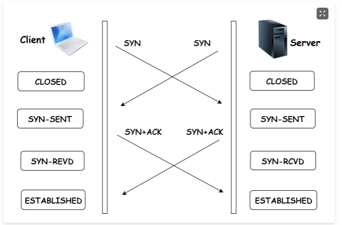
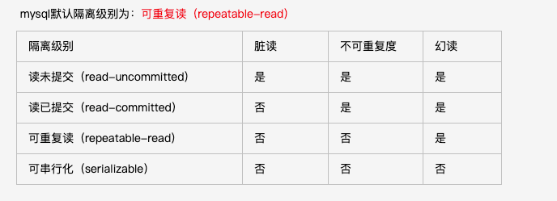

### 一面

#### 1. Tcp的三次握手四次挥手？可不可以两次握手？（不可以）可不可以三次挥手（可以，server不发包的时候给一条FIN=1的ACK）？三次握手期间除了建立连接，还有互相交换什么信息？（窗口大小）

1) 可不可以2次握手？

答：不可以
   根本原因: 无法确认客户端的接收能力。
   分析如下:
   如果是两次，在发了 SYN 报文想握手，但是这个包滞留在了当前的网络中迟迟没有到达，TCP 以为这是丢了包，于是重传，两次握手建立好了连接。
   看似没有问题，但是连接关闭后，如果这个滞留在网路中的包到达了服务端呢？这时候由于是两次握手，服务端只要接收到然后发送相应的数据包，就默认建立连接，但是现在客户端已经断开了。

2) 为什么不是四次握手？
 
  答： 三次握手的目的是确认双方发送和接收的能力。但为了解决问题，三次就足够了，再多用处就不大了。

3) 三次握手过程中可以携带数据么？
   
   第三次握手的时候，可以携带。前两次握手不能携带数据。
   如果前两次握手能够携带数据，那么一旦有人想攻击服务器，那么他只需要在第一次握手中的 SYN 报文中放大量数据，那么服务器势必会消耗更多的时间和内存空间去处理这些数据，增大了服务器被攻击的风险。
   第三次握手的时候，客户端已经处于ESTABLISHED状态，并且已经能够确认服务器的接收、发送能力正常，这个时候相对安全了，可以携带数据。

4) 同时打开会怎样？[如果双方同时发 SYN报文，状态变化会是怎样的呢？]
   
   在发送方给接收方发SYN报文的同时，接收方也给发送方发SYN报文
   发完SYN，两者的状态都变为SYN-SENT。
   在各自收到对方的SYN后，两者状态都变为SYN-REVD。
   接着会回复对应的ACK + SYN，这个报文在对方接收之后，两者状态一起变为ESTABLISHED。
   这就是同时打开情况下的状态变迁。

5) 为什么是四次挥手而不是三次？
   
   因为服务端在接收到FIN, 往往不会立即返回FIN, 必须等到服务端所有的报文都发送完毕了，才能发FIN。因此先发一个ACK表示已经收到客户端的FIN，延迟一段时间才发FIN。这就造成了四次挥手。 
   
6) 如果是三次挥手会有什么问题？
   等于说服务端将ACK和FIN的发送合并为一次挥手，这个时候长时间的延迟可能会导致客户端误以为FIN没有到达客户端，从而让客户端不断的重发FIN。

7) TCP怎么保证可靠呢？
   
   答：它提供了乱序重排、应答确认、报文重传和流量控制四种机制。

8) TCP 的拥塞控制原理是什么？UDP 有对应的拥塞控制功能嘛？

         TCP 拥塞控制的目标是最大化利用网络上瓶颈链路的带宽。
   
   原理： 只要网络中没有出现拥塞，拥塞窗口的值就可以再增大一些，以便把更多的数据包发送出去，但只要网络出现拥塞，拥塞窗口的值就应该减小一些，以减少注入到网络中的数据包数

9) 三次握手过程中有哪些不安全性?
 
      1.SYN flood 泛洪攻击
         
        解决方案：
             1、降低SYN timeout时间，使得主机尽快释放半连接的占用 
             2、采用SYN cookie设置，如果短时间内连续收到某个IP的重复SYN请求，则认为受到了该IP的攻击，丢弃来自该IP的后续请求报文
             3、在网关处设置过滤，拒绝将一个源IP地址不属于其来源子网的包进行更远的路由
      2.Land 攻击

10) 三次握手期间除了建立连接，还有互相交换什么信息？

答：窗口大小

#### 2. TCP和UDP区别（简单答了一下就过了）

####  3. 进程和线程有什么区别？为什么会出现僵尸进程？僵尸进程和孤儿进程区别是什么？孤儿进程如何善终？进程的状态（逻辑状态和ps指令看到的状态分别回答）
1. 为什么会出现僵尸进程？
答：僵尸进程是当子进程比父进程先结束，而父进程又没有回收子进程，释放子进程占用的资源，此时子进程将成为一个僵尸进程。
   如果父进程先退出 ，子进程被init接管，子进程退出后init会回收其占用的相关资源
   
    1.1 进程结束后为什么要进入僵尸状态?
   
     答：因为父进程可能需要子进程的退出状态等信息。
    
    1.2 僵尸进程会带来什么危害？
    
    答：
    + 进程号就会被一直占用了。但系统所能使用的进程号的有限的，如果产生大量的僵尸进程，将导致系统没有可用的进程号而导致系统不能创建进程。所以我们应该避免僵尸进程； 
    + 如果子进程表太大，init接管僵尸进程这个过程就会变慢，在init未发现他们之前，僵尸进程依旧会消耗系统的资源；

    1.3 .如何处理僵尸进程？
    
    答：
    + 正常情况下，需要父进程来“收尸”，但是如果父进程fork（）之前既没安装SIGCHLD信号处理函数调用waitpid（）等待子进程结束，又没有显式忽略该信号，则子进程成为僵尸进程后，该僵尸进程无法正常结束，即使是root身份kill -9也不能杀死僵尸进程；
    + 此时如果僵尸进程的父进程会自动结束，那么僵尸进程成为"孤儿进程"，过继给1号进程init，init始终会负责清理僵尸进程；
    + 如果不能自动结束（比如是个循环，不会结束），此时子进程会一直保持僵尸状态，这种情况下只能通过强制杀死父进程的方式消除僵尸进程。

2. 僵尸进程和孤儿进程区别是什么
  
    1. 孤儿进程：父进程结束了，而它的一个或多个子进程还在运行，那么这些子进程就成为孤儿进程(father died)。子进程的资源由init进程(进程号PID = 1)回收。

### 二面
#### 1. 项目中落到db的操作是如何调优的？
答：拒绝后端的for循环，尽量使用联表，有层级的话使用SQL的递归，或者是嵌套子查询

#### 2. Redis是用在什么场景？
答：对一致性要求不高的统计类数据，或者是对一致性要求较高但是对后端压力较大的的复杂查询

#### 3. 怎样处理一致性的？
答：建立接口到数据库表的依赖，加入手动删除缓存的机制

#### 4. 上述方案还有什么问题？
答：容易错杀无辜，干掉无关的缓存，但至少一致性是可以保证的，在写少读多的场景是适用的

### 三

#### 1. 虚拟内存是什么用途，如何实现？

1. 定义：虚拟内存技术就是一种使用硬盘等外部存取设备， 来保存物理内存不足以存放的信息的技术。
2. 实现方式：
   + 请求分页存储管理。
   + 请求分段存储管理。
   + 请求段页式存储管理

#### 2. Tcp四次挥手，为什么要有Time-Wait的两个往返时间？如果有大量的Time-Wait会占用哪些资源？最应该的care的资源是什么？（端口号）
1. 为什么要有2个Time-Wait的两个往返时间？
答： 
   1）、为了保证客户端发送的最后一个ACK报文段能够到达服务器。因为这个ACK有可能丢失，从而导致处在LAST-ACK状
态的服务器收不到对FIN-ACK的确认报文。服务器会超时重传这个FIN-ACK，接着客户端再重传一次确认，重新启动时间
等待计时器。最后客户端和服务器都能正常的关闭。假设客户端不等待2MSL，而是在发送完ACK之后直接释放关闭，一
但这个ACK丢失的话，服务器就无法正常的进入关闭连接状态。

  2）、还可以防止已失效的报文段。客户端在发送最后一个ACK之后，再经过经过2MSL，就可以使本链接持续时间内所产
生的所有报文段都从网络中消失。从而保证在关闭连接后不会有还在网络中滞留的报文段去骚扰服务器。

注意：在服务器发送了FIN-ACK之后，会立即启动超时重传计时器。客户端在发送最后一个ACK之后会立即启动时间等待计时器。

【  
   + 1 个 MSL 确保四次挥手中主动关闭方最后的 ACK 报文最终能达到对端
   + 1 个 MSL 确保对端没有收到 ACK 重传的 FIN 报文可以到达

】

2. 如果有大量的Time-Wait会占用哪些资源？
端口
   在高并发短连接的TCP服务器上，当服务器处理完请求后立刻主动正常关闭连接。这个场景下会出现大量socket处于TIME_WAIT状态。如果客户端的并发量持续很高，此时部分客户端就会显示连接不上。
   我来解释下这个场景。主动正常关闭TCP连接，都会出现TIMEWAIT。

   为什么我们要关注这个高并发短连接呢？有两个方面需要注意：
   1. 高并发可以让服务器在短时间范围内同时占用大量端口，而端口有个0~65535的范围，并不是很多，刨除系统和其他服务要用的，剩下的就更少了。
   2. 在这个场景中，短连接表示“业务处理+传输数据的时间 远远小于 TIMEWAIT超时的时间”的连接。

#### 3. 数据库的ACID分别是什么？隔离级别有哪些？不同的隔离级别分别解决了哪些并发问题？幻读和不可重复读有什么区别，为什么会有这种区别？如何在可重复读级别解决幻读？mvcc是怎么解决幻读问题（RW时间戳）？基于RW时间戳解决幻读的具体策略大概是什么？
1. 数据库的ACID分别是什么？
 + 一致性
 + 隔离性
 + 持久性
 + 原子性

2. 隔离级别有哪些？
 + 未提交读
 + 读已提交
 + 可重复度
 + 串行化

3. 不同的隔离级别分别解决了哪些并发问题？

   1)、脏读

         一个事务读取另外一个事务还没有提交的数据叫脏读。
   
         例如：事务A读取了事务B更新的数据，然后B回滚操作，那么A读取到的数据是脏数据

   2)、不可重复读
   
         同一个事务中，多次读出的同一数据是不一致的。
   
         例如：事务 A 多次读取同一数据，事务 B 在事务A多次读取的过程中，对数据作了更新并提交，导致事务A多次读取同一数据时，结果不一致。

   3)、幻读
   
         同一个事务中，按照同一条件读取出的数据量(也就是条数)不一致。
   
        例如：事务 A 多次读取满足条件(比如age>=10)的数据，事务 B 在事务A多次读取的过程中，对数据作了新增或删除，导致事务A多次读取同一条件的数据时，数据量不一致。

4. 不可重复读和幻读的区别：

   + 不可重复读：主要是说多次读取一条记录, 发现该记录中某些列值被修改过。
  
   + 幻读：主要是说多次读取一个范围内的记录(包括直接查询所有记录结果或者做聚合统计), 发现结果不一致(标准档案一般指记录增多, 记录的减少应该也算是幻读)
另外需要提一句，mysql的innodb的mvcc已经帮我们解决了幻读的问题，后续我在给大家详细解释下mvcc。
     
5. mvcc是怎么解决幻读问题（RW时间戳）？基于RW时间戳解决幻读的具体策略大概是什么？

6. 什么是MVCC？
多版本并发控制。InnoDB为每行记录添加了一个版本号（系统版本号），每当修改数据时，版本号加一。
在读取事务开始时，系统会给事务一个当前版本号，事务会读取版本号<=当前版本号的数据，这时就算另一个事务插入一个数据，并立马提交，新插入这条数据的版本号会比读取事务的版本号高，因此读取事务读的数据还是不会变。

#### 4. 完整性约束包括哪些?
数据完整性(Data Integrity)是指数据的精确(Accuracy)和可靠性(Reliability)。
分为以下四类:
   1. 实体完整性:规定表的每一行在表中是惟一的实体。
   2. 域完整性:是指表中的列必须满足某种特定的数据类型约束，其中约束又包括 取值范围、精度等规定。
   3. 参照完整性:是指两个表的主关键字和外关键字的数据应一致，保证了表之间 的数据的一致性，防止了数据丢失或无意义的数据在数据库中扩散。
   4. 用户定义的完整性:不同的关系数据库系统根据其应用环境的不同，往往还需 要一些特殊的约束条件。用户定义的完整性即是针对某个特定关系数据库的约束 条件，它反映某一具体应用必须满足的语义要求。
与表有关的约束:包括列约束(NOT NULL(非空约束))和表约束(PRIMARY KEY、 foreign key、check、UNIQUE) 。

#### 5. 有哪些协议是基于 TCP 的，哪些是基于 UDP 的

1. 基于TCP的有FTP、Telnet、SMTP、HTTP、POP3与DNS
2. 基于UDP的有TFTP、SNMP与DNS
3. 其中DNS既可以基于TCP，也可以基于UDP。

#### 6. IO模型有哪些
1. 应用层
2. 表示层
3. 会话层
4. 传输层
5. 网络层
6. 数据链路层
7. 物理层

#### 7. 11种状态
1. LISTEN：等待从任何远端TCP 和端口的连接请求。
2. SYN_SENT：发送完一个连接请求后等待一个匹配的连接请求。
3. SYN_RECEIVED：发送连接请求并且接收到匹配的连接请求以后等待连接请求确认。
4. ESTABLISHED：表示一个打开的连接，接收到的数据可以被投递给用户。连接的数据传输阶段的正常状态。
5. FIN_WAIT_1：等待远端TCP 的连接终止请求，或者等待之前发送的连接终止请求的确认。
6. FIN_WAIT_2：等待远端TCP 的连接终止请求。
7. CLOSE_WAIT：等待本地用户的连接终止请求。
8. CLOSING：等待远端TCP 的连接终止请求确认。
9. LAST_ACK：等待先前发送给远端TCP 的连接终止请求的确认（包括它字节的连接终止请求的确认）
10. TIME_WAIT：等待足够的时间过去以确保远端TCP 接收到它的连接终止请求的确认。
11. TIME_WAIT 两个存在的理由：
    1. 可靠的实现tcp全双工连接的终止；
    2. 允许老的重复分节在网络中消逝。
12. CLOSED：不在连接状态（这是为方便描述假想的状态，实际不存在）
