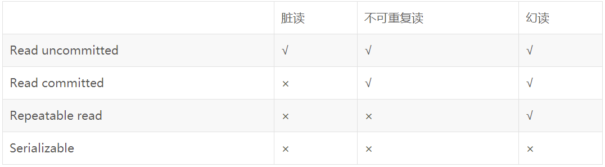

###1. 事务特性【ACID】
+ 原子性[Atomicity]
+ 一致性[Consistency]
+ 隔离性[Isolation]
+ 持久性[Durability]

###2. 数据库隔离级别
+ 读未提交 
  
    含义：就是一个事务可以读取另一个未提交事务的数据。
   
    事例：老板要给程序员发工资，程序员的工资是3.6万/月。但是发工资时老板不小心按错了数字，按成3.9万/月，该钱已经打到程序员的户口，但是事务还没有提交，
  就在这时，程序员去查看自己这个月的工资，发现比往常多了3千元，以为涨工资了非常高兴。但是老板及时发现了不对，马上回滚差点就提交了的事务，将数字改成3.6万再提交。

    分析：实际程序员这个月的工资还是3.6万，但是程序员看到的是3.9万。他看到的是老板还没提交事务时的数据。这就是脏读。
+ 读已提交：当前读[update delete  insert, for update, in share mode]
  
    优势：解决脏读
  
    含义：一个事务要等另一个事务提交后才能读取数据

    事例：程序员拿着信用卡去享受生活（卡里当然是只有3.6万），当他埋单时（程序员事务开启），收费系统事先检测到他的卡里有3.6万，就在这个时候！！
  程序员的妻子要把钱全部转出充当家用，并提交。当收费系统准备扣款时，再检测卡里的金额，发现已经没钱了（第二次检测金额当然要等待妻子转出金额事务提交完）。
  程序员就会很郁闷，明明卡里是有钱的…

    分析：这就是读提交，若有事务对数据进行更新（UPDATE）操作时，读操作事务要等待这个更新操作事务提交后才能读取数据，可以解决脏读问题。
  但在这个事例中，出现了一个事务范围内两个相同的查询却返回了不同数据，这就是不可重复读
+ 可重复读：快照读 [select]  [指update]
  
    含义：在开始读取数据（事务开启）时，不再允许修改操作

    事例：程序员拿着信用卡去享受生活（卡里当然是只有3.6万），当他埋单时（事务开启，不允许其他事务的UPDATE修改操作），收费系统事先检测到他的卡里有3.6万。这个时候他的妻子不能转出金额了。接下来收费系统就可以扣款了。

    分析：重复读可以解决不可重复读问题。写到这里，应该明白的一点就是，不可重复读对应的是修改，即UPDATE操作。但是可能还会有幻读问题。因为幻读问题对应的是插入INSERT操作，而不是UPDATE操作。
+ 串行化
   
   含义：最高的事务隔离级别，在该级别下，事务串行化顺序执行，可以避免脏读、不可重复读与幻读。但是这种事务隔离级别效率低下，比较耗数据库性能，一般不使用。

###3. 幻读&不可重复读
  
####3.1 幻读[指insert&delete操作]
1. 含义： 幻读是读取了其他事务新增的数据

2. 什么时候会出现幻读
   事例：程序员某一天去消费，花了2千元，然后他的妻子去查看他今天的消费记录（全表扫描FTS，妻子事务开启），看到确实是花了2千元，就在这个时候，程序员花了1万买了一部电脑，即新增INSERT了一条消费记录，并提交。当妻子打印程序员的消费记录清单时（妻子事务提交），发现花了1.2万元，似乎出现了幻觉，这就是幻读

3. 解决： 解决：使用表级锁，锁定整张表，事务A多次读取数据总量之后才释放该锁，这个时候才允许其他事务新增数据。

####3.2 不可重复读[针对insert和delete操作]
+ 含义：读取了其他事务更改的数据
+ 解决：使用行级锁，锁定该行，事务A多次读取操作完成后才释放该锁，这个时候才允许其他事务更改刚才的数据。

###4. MVCC
mvcc: 多版本并发控制，一行数据可能存在多个版本
英文全称为Multi-Version Concurrency Control，乐观锁为理论基础的MVCC（多版本并发控制），MVCC的实现没有固定的规范。每个数据库都会有不同的实现方式

包含：隐藏ID，事务ID,回滚指针

1.MVCC手段只适用于Msyql隔离级别中的读已提交（Read committed）和可重复读（Repeatable Read）.

2.Read uncimmitted由于存在脏读，即能读到未提交事务的数据行，所以不适用MVCC.
原因是MVCC的创建版本和删除版本只要在事务提交后才会产生。

3.串行化由于是会对所涉及到的表加锁，并非行锁，自然也就不存在行的版本控制问题。

4.通过以上总结，可知，MVCC主要作用于事务性的，有行锁控制的数据库模型。

   
###5. 乐观锁&悲观锁

####5.1 悲观锁
1. 定义：
   
   每次获取数据的时候，都会担心数据被修改，所以每次获取数据的时候都会进行加锁，确保在自己使用的过程中数据不会被别人修改，使用完成后进行数据解锁。
   由于数据进行加锁，期间对该数据进行读写的其他线程都会进行等待。
   
2. 使用场景：
   
   比较适合写入操作比较频繁的场景，如果出现大量的读取操作，每次读取的时候都会进行加锁，这样会增加大量的锁的开销，降低了系统的吞吐量。

####5.2 乐观锁
1. 定义：

  每次获取数据的时候，都不会担心数据被修改，所以每次获取数据的时候都不会进行加锁，但是在更新数据的时候需要判断该数据是否被别人修改过。
  如果数据被其他线程修改，则不进行数据更新，如果数据没有被其他线程修改，则进行数据更新。由于数据没有进行加锁，期间该数据可以被其他线程进行读写操作。

2. 使用场景：

   比较适合读取操作比较频繁的场景，如果出现大量的写入操作，数据发生冲突的可能性就会增大，为了保证数据的一致性，应用层需要不断的重新获取数据，这样会增加大量的查询操作，降低了系统的吞吐量。

总结：两种所各有优缺点，读取频繁使用乐观锁，写入频繁使用悲观锁。

像乐观锁适用于写比较少的情况下，即冲突真的很少发生的时候，这样可以省去了锁的开销，加大了系统的整个吞吐量。但如果经常产生冲突，上层应用会不断的进行retry，这样反倒是降低了性能，所以这种情况下用悲观锁就比较合适,之所以用悲观锁就是因为两个用户更新同一条数据的概率高，也就是冲突比较严重的情况下，所以才用悲观锁.

悲观锁比较适合强一致性的场景，但效率比较低，特别是读的并发低。乐观锁则适用于读多写少，并发冲突少的场景。

###6. 

