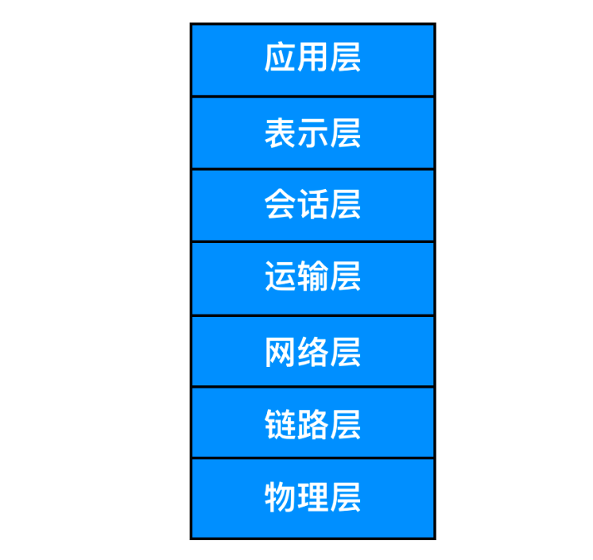
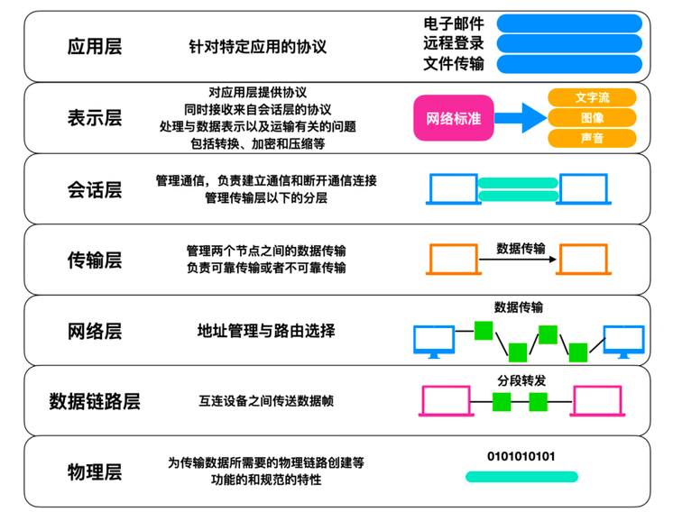

###OSI 标准模型
7层协议：

####7层对应详解

+ 应用层：应用层是 OSI 标准模型的最顶层，是直接为应用进程提供服务的。其作用是在实现多个系统应用进程相互通信的同时，完成一系列业务处理所需的服务。包括文件传输、电子邮件远程登录和远端接口调用等协议。
+ 表示层:  表示层向上对应用进程服务，向下接收会话层提供的服务，表示层位于 OSI 标准模型的第六层，表示层的主要作用就是将设备的固有数据格式转换为网络标准传输格式。
+ 会话层：会话层位于 OSI 标准模型的第五层，它是建立在传输层之上，利用传输层提供的服务建立和维持会话。
+ 传输层：传输层位于 OSI 标准模型的第四层，它在整个 OSI 标准模型中起到了至关重要的作用。传输层涉及到两个节点之间的数据传输，向上层提供可靠的数据传输服务。传输层的服务一般要经历传输连接建立阶段，数据传输阶段，传输连接释放阶段 3 个阶段才算完成一个完整的服务过程。
+ 网络层：网络层位于 OSI 标准模型的第三层，它位于传输层和数据链路层的中间，将数据设法从源端经过若干个中间节点传送到另一端，从而向运输层提供最基本的端到端的数据传送服务。
+ 数据链路层：数据链路层位于物理层和网络层中间，数据链路层定义了在单个链路上如何传输数据。
+ 物理层：物理层是 OSI 标准模型中最低的一层，物理层是整个 OSI 协议的基础，就如同房屋的地基一样，物理层为设备之间的数据通信提供传输媒体及互连设备，为数据传输提供可靠的环境。

####4层
应用层：http smtp ftp dns telnet
传输协议： tcp  udp
网络层协议：ip  icmp  arp
链路控制协议：  RIP OSPF  BGP