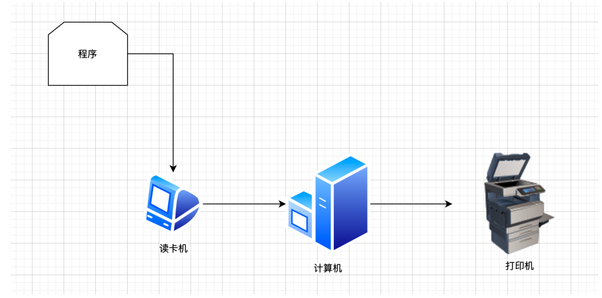
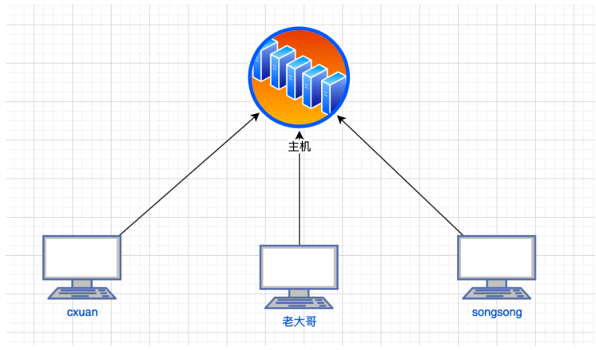

1.计算机网络按规模进行划分: LAN(Local area Network, 局域网)， WAN(Wide Area Network, 广域网)

###批处理
1.定义：批处理就是事先将数据装入卡带或者磁带，并且由计算机按照一定的顺序进行读入

###分时系统
定义：在批处理之后出现的就是分时系统了，分时系统指的是多个终端与同一个计算机连接，允许多个用户同时使用一台计算机。分时系统的出现实现了一人一机的目的，让用户感觉像是自己在使用计算机，实际上这是一种 独占性 的特性。

###互联网协议
定义：网络协议就是网络中(包括互联网)传递、管理信息的一些规范。如同人与人之间相互交流是需要遵循一定的规矩一样，计算机之间的相互通信需要共同遵守一定的规则，这些规则就称为网络协议
